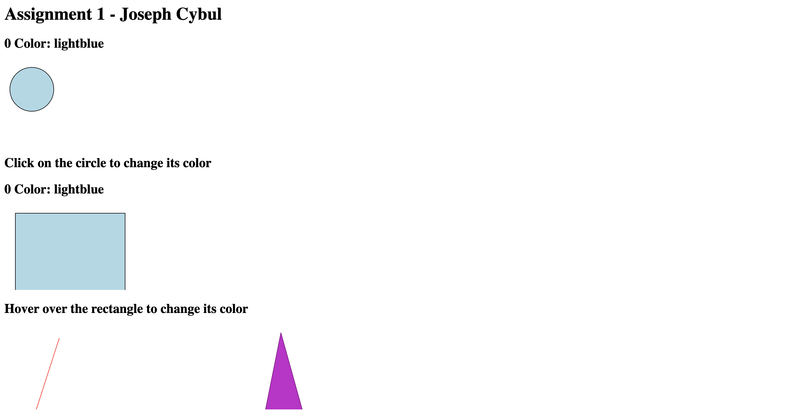
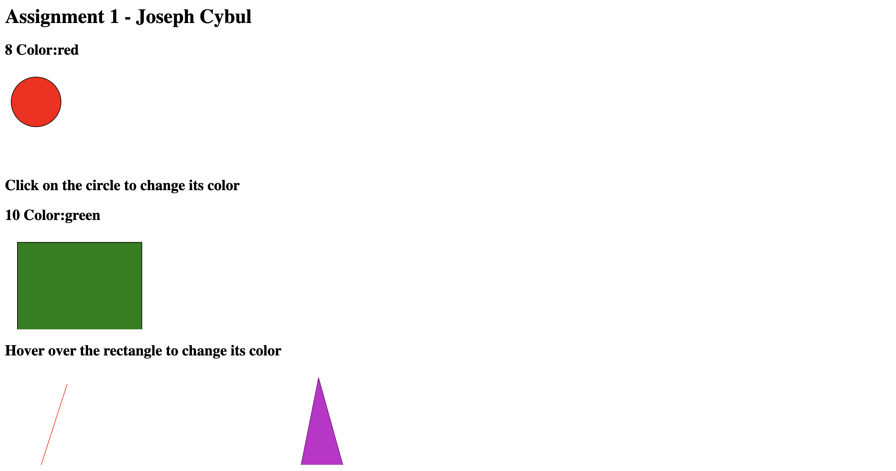

Joseph Cybul- A1
--
For this assignemnt I started by testing out how to create differnt shapes, first a circle rectangle, and then moved on to drawing lines and polygons. once I was confortable with creating shapes, I decided to experiment with differnt colors, which was not too diffcult. So I decided to find ways to change the colors of the shapes. For design Achivements, I decied to have text to indicate the functionslity of the page, as well as one examle of each shape I created. As for the technical achivements, I explored differen ways i could use the mouse to trigger actions, first by clicking on the circle and causing it to change its color, and then by hovering over the rectangle to also change its color. I then recored live how many times the color had changed and the current color for both the circle and the rectangle. 

Link to page: https://jcybul.github.io/a1-ghd3/

* Screenshot of the page when its first opend.

* Screenshot of the page after some changes.

