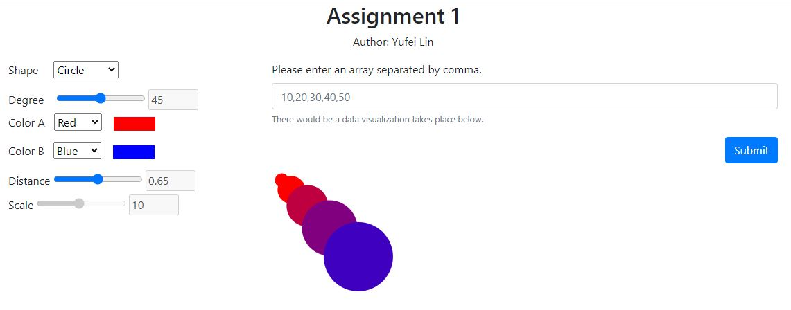
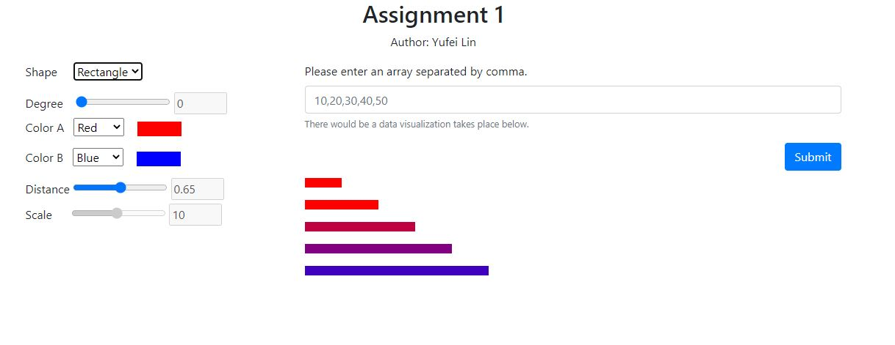
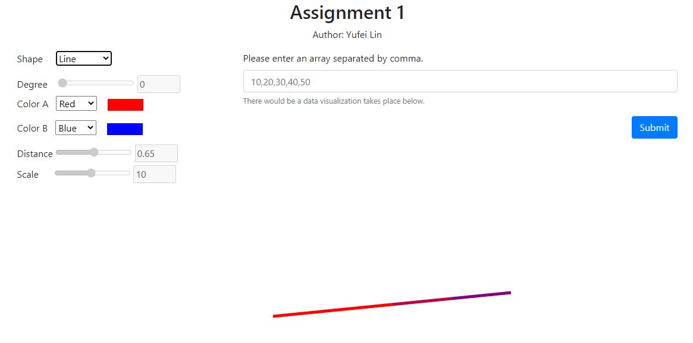
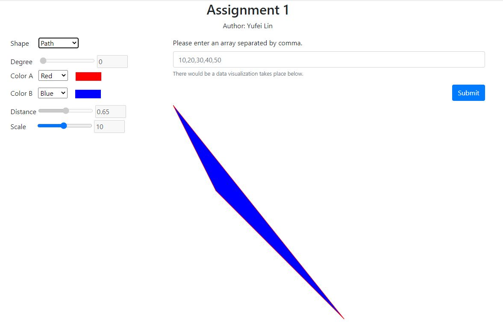

Assignment 1 - Hello World: GitHub and d3  
===

Link to project: [https://yufeilinulysses.github.io/a1-ghd3/index.html](https://yufeilinulysses.github.io/a1-ghd3/index.html)

Project Descriptions
---

This project is targeted towards a demonstration on how D3 could be used to illustrate data. Therefore, it is set to be an interactive interface for users to submit an array like data and manipulate with the shapes they have created. This application provides several different input for users to change different perspectives of the data visualization: shape, colors, distance and scale.  

<bold>I. Circles</bold>

This section provides a loading transition for the circles, and the distance between circles could be determined by the distance slider, and the color A and B would be indicating the value of the elements.   

<bold>II. Rectangles</bold>

Rectangles are designed in a way to represent data in a bar chart format. This has a similar feature as the circles. And these rectangles could be aligned on different angles to make different arrangement for data representations. 

<bold>III. Line</bold>

This line graph is using the D3 line feature and having a similar color schema as circles and rectangles.   

<bold>IV. Path</bold>

In this section, data is used to form a polygon with a closed path.   

Technical Achievement Desription
---

1. Application of Bootstrap.js for better page arrangements
2. Utilizes all four shapes with a variation in colors and transitions
3. Offer slidebar and other ways for user interactivity

Design Achievement Description
---

1. Provide sufficient amount of ways for users to interact with data
2. Offer a range of color palette for users to choose from
3. Circles are aligned specifically to achieve an artistic feeling.

